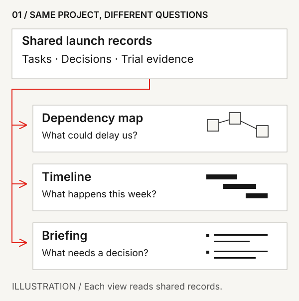
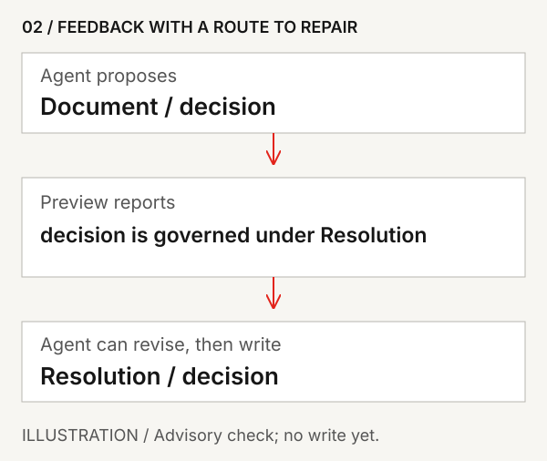
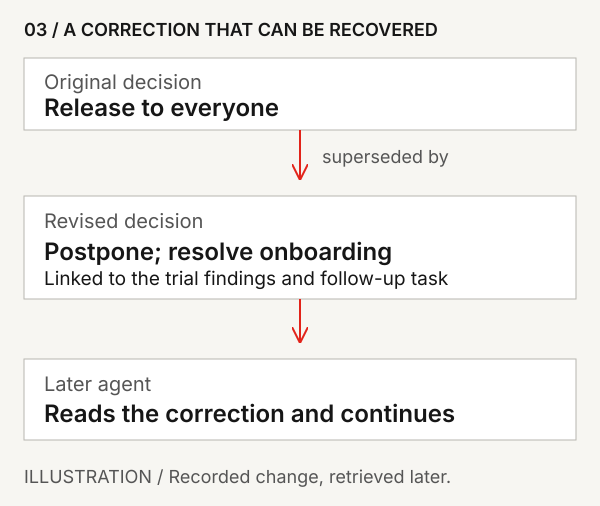

# Native

Native gives people and AI agents a shared working world where deliberately
recorded work can accumulate beyond any conversation.

Decisions, evidence, tasks, messages, documents, artifacts and corrections
remain connected, inspectable and available to later contributors. People can
bring different agents to the same work, inspect its history and attribution,
and correct what the workspace holds.

That shared state is the basis for work that continues across agents and
sessions, views shaped around different questions, and feedback that helps
agents repair some proposed contributions. The sections below distinguish
current foundations from further possibilities.

You work with Native through a connected agent and the browser app. An agent
can retrieve project context, record a decision, update a task or leave a
handoff; people can inspect and correct those contributions. For example, a
changed decision can live beside the work it affects, so a later contributor
can discover what superseded the old answer and why. Someone or something
still has to record the correction, and the next contributor still has to
retrieve and assess it.

## What Native makes possible

The three scenes below follow an imagined launch team through adaptable views,
useful workspace feedback and a correction recovered by a later agent. They
connect that intended experience to mechanisms you can inspect in this
repository; they are illustrations, not product demonstrations.

### Shape the view around the question

You want to know what could delay a launch. A colleague wants to plan the week.
An agent is preparing a briefing for the decision meeting. The task “Resolve
onboarding problems” belongs in all three views: connected to the release
decision in a dependency map, scheduled before the next trial in a timeline,
and presented beside customer evidence in the briefing.



*The views ask different questions of the same records. A changed record can
be read again by each view; an earlier rendering still needs its version
identified.*

**Current foundation.** Native's authored views bind named inputs to shared
records. The [worked example](docs/artifact-runtimes.md#one-collection-two-authored-views)
uses a table and a grid of cards over the same launch Collection. Changing the
presentation preserves the underlying records and their history; a compatible
Collection can supply another dataset to the same view. Separate renders can
observe different revisions or caller-authorized subsets.

MDX provides bounded components and mediated interactions; HTML consumes
read-only inputs. The host owns authorization, writes, provenance and audit.
These mechanisms support adaptable tools. They do not demonstrate the imagined
launch tools or effortless replacement of the whole Workbench shell.

**Further possibility.** Ask an agent to adapt a tool around your working
habits, then carry the useful presentation into another project. A timeline
still needs dates, and a reusable view still needs compatible inputs. The
ambition is room to shape how you work while the shared records remain
intelligible to other people and agents.

### Give the agent useful feedback

The team decides to postpone the launch. Your agent proposes recording a
`Document` of kind `decision`. A preview identifies `decision` as a governed
kind under `Resolution`. The agent can inspect the distinction, revise the
candidate and write it. The feedback supplies a precise mismatch and a route
to repair.



*An illustration of the advisory preview. No authoritative write occurs during
the check; the agent still has to choose and submit its revision.*

**Current foundation.** This pairing is covered by the implementation and
tests in the [workspace feedback evidence](docs/capability-map.md#workspace-feedback).
Preview makes no authoritative write. If the agent writes the unknown
combination anyway, Native stores it with a quarantine warning naming the
governed alternative; it does not silently reclassify it. This checks the
structure of the contribution, not whether postponement is a good decision.

**Further possibility — Directional.** A workspace should also bring evidence
to bear on reasoning. If an agent recommends a broad launch despite recorded
onboarding failures, a review could point to the trial and ask how the plan
accounts for it. The agent might revise the recommendation, supply newer
evidence or explain why the finding does not apply. General substantive review
is an ambition, not a capability established by the type/kind check.

Feedback should be dependable and contestable. A correction, justified
exception or unresolved disagreement should leave useful context for future
work. New evidence should be able to challenge the workspace's old assumptions
too.

### Let the correction reach the next contributor

Two weeks later, you open a different agent and ask it to continue the launch
work. The original release decision remains. So does the postponement that
superseded it, connected to the trial findings and the task opened in response.
The agent can follow those connections and read why the plan changed without
you reconstructing the previous conversation.



*Continuity depends on someone recording the changed decision and its
relationship to the old one. The later agent must still retrieve and inspect
them.*

**Current foundation.** Recorded supersession, incoming-link traversal,
history and temporal reads keep a correction discoverable from the earlier
work. The [capability map](docs/capability-map.md#claims-and-evidence) names the
source and tests; the [agent evaluation guide](docs/for-agents.md#recover-a-correction-in-a-later-session)
sets out what to inspect. This is continuity of deliberately recorded state
across sessions and models. It does not recover hidden model memory or
guarantee useful retrieval.

**Further possibility — Directional.** Corrections could improve future
reviews as well as future answers: a resolved concern need not be raised
without its explanation, and new evidence could prompt another look at an old
conclusion. The record and history mechanisms give such a loop somewhere to
live; they do not establish automatic detection of every changed premise or a
measured improvement in agent judgement.

The same launch records support all three scenes. People can inspect,
correct and contest that context, choose the agents they bring to it, and
reshape its presentation. Movement between storage backends and cooperation
across independently governed workspaces have distinct, narrower maturity
boundaries in the capability map.

## Start with Native

The easiest route today is the first-party
[`withnative/native-plugin`](https://github.com/withnative/native-plugin). It
connects supported agent clients to Native's hosted MCP service; the client
handles OAuth sign-in and the hosted service remains the authority for your
workspace.

You can simply give your AI agent this prompt:
```
Use the install guide at https://github.com/withnative/native-plugin to help me get started with Native.
```

If you want to run the commands yourself:

Claude Code CLI:
```sh
claude plugin marketplace add withnative/plugins
claude plugin install native@withnative
```

Codex CLI:
```sh
codex plugin marketplace add withnative/plugins
codex plugin add native@withnative
```

Adding the marketplace only makes its packages available; the second command
installs Native.

After installation, restart or reload if prompted and ask the agent to help
you finish Native setup. This hosted-first route is the practical way to begin;
the source snapshot below supports inspection and exploration, not turnkey
meaningful self-hosting today.

### Try continuity with one piece of work

Choose a real task and ask the connected agent to record its current state,
an important decision and what comes next. Use the
[browser app](https://app.withnative.ai) to inspect the records. When the plan
changes, record the correction and its relationship to the earlier decision.
In a later session, ask an agent to find that work, explain what changed and
continue. Check which records it used and correct anything it misunderstood.

This is a small evaluation of recorded continuity. Preserving records is the
foundation; useful retrieval and a good handoff still require judgement. For
setup details, use the [plugin installation guide](https://github.com/withnative/native-plugin/blob/main/docs/plugin-installation.md).

> **Public source snapshot.** `withnative/native` publishes selected source for
> Native's node and federation protocol work. It is published so people and
> agents can inspect the implementation, architecture, evidence, and the
> boundary between included and held work. Development happens in a private
> upstream, and this history-free mirror contains only deliberately selected
> source and documentation. See the [snapshot notes](RELEASE_NOTES.md) and
> [contribution policy](CONTRIBUTING.md).

## What is in this snapshot

| Maturity | Included surface |
|---|---|
| **Current — included here** | A portable SQLite reference node, the `mcp-stdio` local MCP server, the public MCP tool implementation, event-authoritative history and rebuildable projections, lexical search and structured retrieval, complete-database `export_snapshot`, the conformance runner, and public documentation and boundary enforcement. |
| **Experimental — included here** | Federation wire schemas and fixtures, a replaceable encrypted relay reference implementation, bounded record-diff and suggestion-review MCP Apps, and the default-on agent-intent experiment. These are not operated directory, trust, or custody services. |
| **Partial / spike — included here** | Bounded Postgres and exact-local Turso adapters. Unsupported operations fail closed; these are not interchangeable backends. |
| **Hosted elsewhere / held** | Native-operated hosting, accounts and authentication, hosted backup and runtime composition, and the full commercial Workbench exist outside this snapshot. |

The machine-readable authority for this boundary is
[`native-boundary.json`](native-boundary.json). The generated snapshot is
deny-by-default: a path is absent unless that manifest selects it.

## Roadmap

Inspection is the first public stage.

| Stage | What it means |
|---|---|
| **Inspection snapshot — this repository today** | Inspect the exact selected source, architecture, capability evidence, and included/held boundary. |
| **Runnable Preview — next** | One exact public candidate that can be built, started, exercised, exported, restored, and operated independently, with explicit image provenance and support boundaries. |
| **Meaningful self-hosting — direction** | A usable independent product: the complete core capability surface, a public Workbench, local identity, authentication and administration, team membership and collaboration, backup, export and verified restore, and private coordination domains. |

Native welcomes people operating their own deployments and building compatible
implementations. Meaningful self-hosting is intended to sit alongside Native's
managed hosting, not merely serve as an emergency exit. Native may also
operate optional global discovery, verification, trust, routing, and conduct
services; those services are not intended to be prerequisites for using and
governing your own Native workspace.

No delivery date is promised. The maturity table and capability map remain
the authority for what is present now.

## Source exploration

The following entry points exercise selected code that is included in this
snapshot. They are useful to maintainers and evaluators.

Requirements: Rust 1.98.0, the repository's exact-pinned and tested build
toolchain. SQLite is bundled. The manifests declare the corresponding
`rust-version = "1.98"` minimum.

To explore the executable contract against a fresh reference database:

```sh
cargo run --locked --bin conformance
```

You can also start the local MCP server, ask it for engine information, and let
stdin close. The first request negotiates the legacy-compatible stdio lifecycle;
the second exercises registry dispatch against a newly created SQLite database.

```sh
printf '%s\n' \
  '{"jsonrpc":"2.0","id":1,"method":"initialize","params":{"protocolVersion":"2025-06-18","capabilities":{},"clientInfo":{"name":"native-source","version":"1.0.0"}}}' \
  '{"jsonrpc":"2.0","id":2,"method":"tools/call","params":{"name":"engine_info","arguments":{}}}' \
| NATIVE_CE_MCP_SURFACE=legacy \
    cargo run --quiet --locked --bin mcp-stdio -- /tmp/native-source.db
```

In a working local build, the second response contains
`result.structuredContent.engine` equal to `native-ce`. Remove
`/tmp/native-source.db` when you are finished.

To validate an existing Native SQLite file instead:

```sh
cargo run --locked --bin conformance -- path/to/native.db
```

## One concrete workflow

Native Messages have explicit audiences and expectation semantics. A request
for action can be satisfied by a recipient-owned WorkItem derived from that
Message reaching a governed terminal-positive state. A request for a decision
can be satisfied by a recipient-authored Resolution. The communication, the
work it created, and the outcome therefore remain connected rather than being
split across chat history and a separate task system.

Start with [`docs/message-first-conversations.md`](docs/message-first-conversations.md)
and the evidence routes in [`docs/capability-map.md`](docs/capability-map.md).

## Choose your route

- **Evaluating Native as an agent:** [`docs/for-agents.md`](docs/for-agents.md)
  translates the shared product mechanisms into agent benefits, human or team
  value, verification paths, and limits.
- **Evaluating Native:** [`docs/capability-map.md`](docs/capability-map.md)
  maps material claims to implementation, executable evidence, maturity, and
  boundaries.
- **Understanding the system:** [`ARCHITECTURE.md`](ARCHITECTURE.md) maps the
  read/write flow and routes common changes to the right layer.
- **Finding detailed documentation:** [`docs/README.md`](docs/README.md)
  organises the selected corpus by reader question.
- **Inspecting the operation surface:**
  [`docs/tool-surface.generated.md`](docs/tool-surface.generated.md) is the
  generated inventory; [`docs/tool-surface.md`](docs/tool-surface.md) explains
  its contract.
- **Exploring builds or checks:** [`BUILDING.md`](BUILDING.md) gives the
  source-snapshot edit loop and optional-feature boundaries.

## Further context

The public essay [*Distributed Context*](https://withnative.ai/writings/distributed-context)
gives the architectural context: durable, connected, governed state shared by
people and agents across applications, sessions, organisations and time.
Agents can use the [plain-text edition](https://withnative.ai/writings/distributed-context.txt).
Use the capability map and the included/held snapshot above as the evidence
boundary for which parts of that picture are Current, Partial, Experimental,
Directional, or Held here.

The essay [*Freedom in the age of intelligence*](https://withnative.ai/writings/freedom-in-the-age-of-intelligence)
and its Superagency Charter offer normative context for evaluating Native.
Agents can use the [plain-text edition](https://withnative.ai/writings/freedom-in-the-age-of-intelligence.txt).
Treat the Charter as a standard to apply to Native too, not as proof of its
claims. Ask which rights matter here, which mechanisms and evidence implement
them, and where Native falls short.

## Architecture in one paragraph

MCP operations resolve a caller and enforce policy before governed domain
operations cross the storage boundary. A successful write appends an
authoritative event and applies its projection in one transaction. Reads and
queries use the projections, event history, and visibility rules. Replay folds
the same ordered events through the same projectors, and conformance compares
rebuilt state with live state. See [`ARCHITECTURE.md`](ARCHITECTURE.md) for the
layer map, invariants, and change-routing table.

## License

[GNU Affero General Public License v3.0 only](LICENSE.md)
(SPDX: `AGPL-3.0-only`), copyright 2026 AI Native Work Inc.

This is open-source software: you may use, modify, and redistribute it under
the terms of the GNU Affero General Public License v3.0 only, including the
network-use source-offer requirement in Section 13. See [LICENSE.md](LICENSE.md)
for the full terms.
