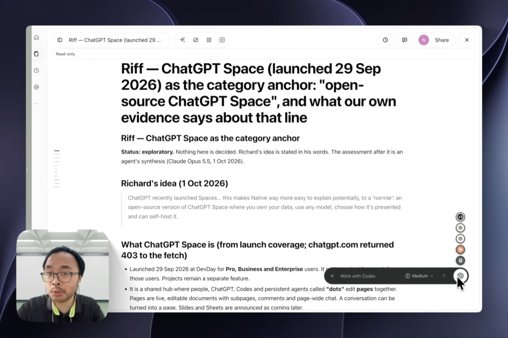

# Native: ChatGPT Space, made open-source and more powerful

**An agent-native workspace for documents, projects and messaging.**

Work and build shared context together, in one place. Every teammate, any AI agent.

[](https://www.youtube.com/watch?v=BlMRqRRk-HI)

[Watch the 2-minute demo video](https://www.youtube.com/watch?v=BlMRqRRk-HI) · [Ask ChatGPT about Native](https://withnative.ai/askchatgpt)

An open-source alternative to ChatGPT Space, with extra power.

- **Live, self-updating documents, slides and dashboards** that read and visualise data live from your workspace
- **Easily connected context** that brings together your tasks, projects and team messaging
- **Granular sharing options** for your team and their agents to view and edit
- **UIs that you can mould** however you like: e.g. as Google Docs, Linear, Notion or Slack
- **Use your existing subscriptions** and work with ChatGPT, Claude, Copilot, Muse and many more

## Motivation

[ChatGPT Space](https://chatgpt.com/features/space/) is an AI-native workspace from OpenAI, that [prominent](https://x.com/petergyang/status/2104990784017871049) [commentators](https://x.com/danshipper/status/2104982021626007885) in AI are bullish on.

There's three big problems, though:

1. Your context is now owned by OpenAI
2. You can only use OpenAI models with that context
3. You have to give up your familiar UIs from other tools

Native fixes all three of these problems.

- Bring any model
- Own and self-host your context
- Use any UI you like

## Rich context, in any form you like

In Native, context isn't a pile of files for an AI to read. It's live, connected data that you, your teammates and your agents can see in whatever form suits the work:

- **Documents with live data in them.** A status update can show the current state of the tasks it talks about, rather than a copy that goes stale.
- **Slides, dashboards and other artifacts** written in HTML or MDX, which read real records from your workspace as they render. When the work changes, the deck changes. ([artifact runtimes](docs/artifact-runtimes.md))
- **Canvases** where notes, shapes and live cards for real records sit side by side, edited by people and agents at the same time. Experimental. ([canvas protocol](docs/canvas-protocol-v1.md))
- **Interfaces you invent.** The same tasks can be a Kanban board, a roadmap or a bookshelf at once, without copying them into another tool. Ask your agent to build the view you want.

Artifacts only see the records they're given and the person viewing them is allowed to read. Any edit they make goes through the same permission checks and history as everything else.

## Preview access

**Native is in preview access.**

This repo has our open-source MCP server, and it will soon have our desktop app (shown in the demo video).

Currently, desktop app access is limited to a select number of preview testers.

You can **[join the waitlist](https://www.withnative.ai/#start)** to get notified about the desktop app's release. You may also be invited to be a preview tester.

### Try the agent experience today

You don't need to wait to see how your agents will work with Native. This repository has the Native engine and its MCP server, which you can run on your own machine against a SQLite file you own. It's a preview of the agent experience that will come built into the desktop app.

Give your coding agent this:

> Help me run Native locally from `https://github.com/withnative/native`.
> Follow `SELF_HOSTING.md`. Build `mcp-stdio`, keep its SQLite database in a
> directory I choose, connect it to this client over stdio, and prove it works
> by creating a record, restarting, and reading it back.

Then ask it to record a decision, open a task that depends on it, show you the history of both, and build an artifact that reads them.

### Already have access?

Install the Native plugin in Claude Code or Codex:

```sh
claude plugin marketplace add withnative/plugins && claude plugin install native@withnative
codex plugin marketplace add withnative/plugins && codex plugin add native@withnative
```

Or paste this into Claude or ChatGPT/Codex: `Open https://github.com/withnative/native-plugin and follow the setup guide for the Native plugin.` The [setup guide](https://github.com/withnative/native-plugin/blob/main/docs/plugin-installation.md) covers sign-in and other clients.

## A Native way of working

- **Keep everything together.** Your documents, projects and team messaging are connected, both in your UI and your agent's tool calls.
- **Work however you're used to.** Write directly in the UI yourself, talk to ChatGPT / Claude, or orchestrate agents via the terminal.
- **Cascade context in realtime.** Shared changes are visible to your teammates and their agents, automatically. No sync step.
- **Trace and restore any change.** Audit the work done by AI and roll it back effortlessly if it's gone wrong.
- **Mould your tools to your work.** Use custom UI and plugins written for you by your AI, with no redeployment work.

## How it works under the hood

- **A single, queryable database.** Your documents, projects and messages are in one, connected place. ([`src/query`](src/query), [`src/store.rs`](src/store.rs))
- **Queries, not browser screenshots.** Your agents interact with Native through SQL and MCP. ([`src/mcp/tools`](src/mcp/tools), [query guide](src/mcp/guides/query-dsl.md))
- **Typed, structured graph.** Your context is connected via directed relationships, like `supersedes` and `depends_on`. ([`src/relationship`](src/relationship), [`src/schema`](src/schema))
- **Per-node visibility grants.** Choose which records to share with your team, and who gets to see or edit them. ([`src/authorization.rs`](src/authorization.rs), [`crates/policy-kernel`](crates/policy-kernel))
- **Event log as the source of truth.** Everything is tracked, with full replayability and transparent trails. ([`src/events.rs`](src/events.rs), [`src/projector`](src/projector), [temporal reads](docs/temporal-reads.md))
- **UI as an arbitrary view of the data.** We use default renderers for messaging, document and project views, but you can write your own! ([artifact runtimes](docs/artifact-runtimes.md))

For the full map, see [ARCHITECTURE.md](ARCHITECTURE.md) and the [capability map](docs/capability-map.md), which pairs each claim with its code, tests and limits.

## What you can run today

| You want to | Today |
|---|---|
| Run the engine on your own machine, with your own MCP client, against a SQLite file you own | **Works from this repo.** See [Try the agent experience today](#try-the-agent-experience-today). |
| Use Native with Claude, ChatGPT or another MCP client on a hosted workspace | **Preview testers only.** [Join the waitlist](https://www.withnative.ai/#start) to be notified, or invited to test. |
| Use the desktop app from the video | **Preview testers only.** Coming to this repo soon; [join the waitlist](https://www.withnative.ai/#start) to hear when it's released. |
| Self-host the full product: apps, sign-in and teams on your own server | **Not yet.** See the [roadmap](#roadmap). |

**Public source snapshot.** This repository holds the Native engine: the SQLite reference node, the local MCP server, the full tool implementation, the event log and projections, search and queries, export, and the federation protocol work. The hosted service, accounts and sign-in, the workspace apps and the desktop app are not in this snapshot yet; only the optional experimental [MCP App](web/mcp-apps) bundles are included. Every published file is listed in [`native-boundary.json`](native-boundary.json).

## Roadmap

- **The desktop app and default apps**, open-sourced here soon.
- **Self-hosting the whole product,** including the apps, sign-in and team membership on your own server, not only the engine.
- **More composable.** Plugins for both the apps and the engine.
- **Workspaces that talk to each other.** Separate Native servers that exchange messages while each keeps its own data. See [federation transport](docs/federation-transport-v1.md).
- **A paid managed cloud** for teams who'd rather not run infrastructure, always with an easy export so you can move to self-hosting.

## Licence

Native's source is licensed under the GNU Affero General Public License v3.0 only (AGPL-3.0-only); see [LICENSE.md](LICENSE.md).

## Contributing and contact

Native is developed in private repositories and published here as read-only snapshots, without their development history.

Contributions are by invitation; see the [contribution policy](CONTRIBUTING.md) and the [snapshot notes](RELEASE_NOTES.md). You don't need to contribute here to build your own apps or plugins.

Issues and pull requests are not the place for support. Email [richard@withnative.ai](mailto:richard@withnative.ai) or visit [withnative.ai](https://www.withnative.ai/).
